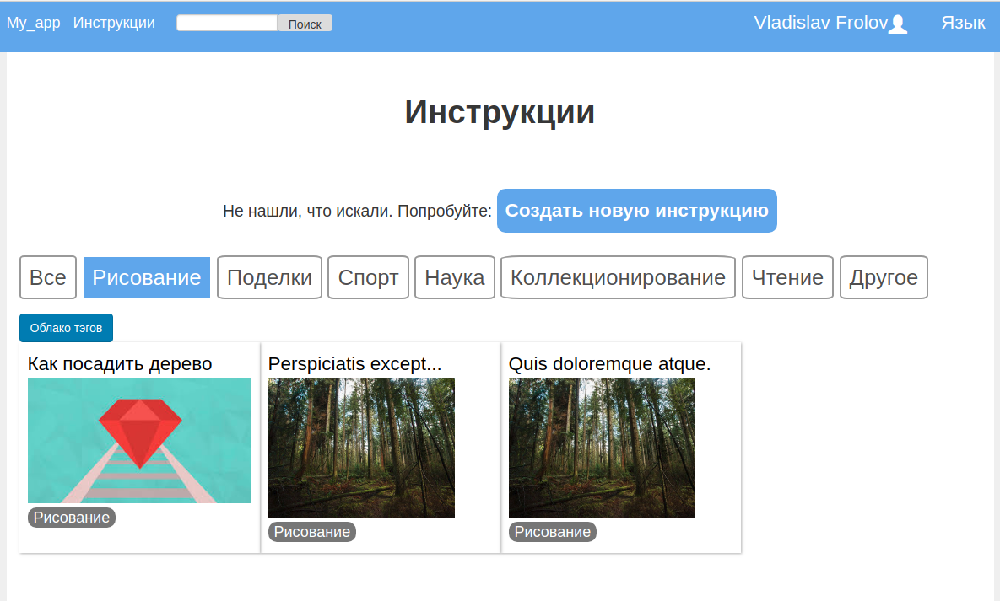

# Instructions Web Application

Functions performed by the web application:
- view instructions, steps and comments to it;
- creating and editing instructions and steps to it;
- commenting and evaluation instructions;
- authorization and registration of users on the site;
- search instructions;
- rewarding active users;
- support of the instruction evaluation system;
- site management using the admin panel;
- save instructions in PDF;
- video playback inside instructions;
- rewarding users.

# Detailed description:
  The application uses some restrictions on access to data: unauthorized users can only read instructions, search instructions are available, creation, commenting and instructions are not available. Authenticated users have access to everything except the admin panel. The admin panel allows you to manage users (view, block, delete, assign administrators). The administrator sees each instruction as its author.
The registration and authorization system has two variations: regular registration and authorization with an email and password, registration and further authorization through social networks. The application used the following social networks: Gmail, GitHub, Facebook, Vkontakte. For each of the social networks used their own dependence Omniauth.
A search engine of instructions is implemented in the following way: full-text search is available from each page (search results are always instructions, for example, if the text is found in the comments to the instructions, then a link to the instructions is displayed. Search Search optimization is used to optimize the search.
Each user has his personal page on which he can manage the list of his instructions (the ability to create / delete / edit instructions), fields with information about the user.
Each instruction consists of a name, tags (you can enter several tags). In addition, the manual contains the description itself support formatting type Trix. You can add drag-n-drop pictures to the description itself, as well as embed a video.
The main page displays the latest updated instructions, instructions with the highest ratings, tag cloud.
The instructions display comments. Comments are non-hierarchical, you cannot comment on a comment, only add at the end. Automatic loading of comments is implemented: if a user has a page with comments and another user adds a new one, then both users will immediately see new comments without reloading the page.
As a comment, you can send an image, video, text. Each user can put down a "rating" (from 1 to 5 stars) instructions (no more than a rating from one user on the outline) - the average rating is displayed in the instruction. The user can put Like and Dislike in the comment (no more than one to one comment from one user).
The site supports two languages: English and Russian (the user chooses and the choice is saved).
Each instruction has a button that allows you to download instructions in PDF formats (generated by the site automatically).
